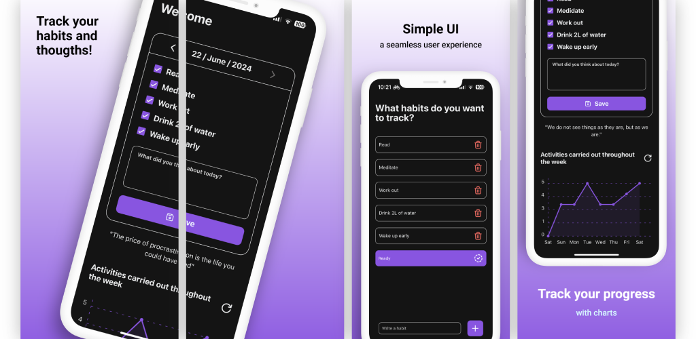

# Habit Diary


### Welcome to **Habit Diary**!

**Habit Diary** is a React Native application to manage your daily tasks, track your statistics and check your progress in an effective and visually attractive way. Ideal to keep you organized and motivated.

---

## Download

You can download the app from the following links:

- **[Google Play Store](https://)** 
- **[App Store]()**


## Features

- **Daily Task Management**: Create, edit and organize your daily tasks.
- **Statistics and Graphs**: View your progress with intuitive graphs.
- **Progress History**: Check your progress history and stay motivated.



---

## Usage

1. **Clone the repository**:
 ```sh
 git clone https://github.com/AdrianPalacios03/HabitDiary.git
 ```
2. **Install the dependencies**:
 ```sh
 npm install
 ```
3. **Start the application**:
 ```sh
 npx run android
 ```
 or
 ```sh
npx run ios
```

## Use
1. **Task Management**

2. **Statistics and Graphs**

3. **Progress History**

---

## Technologies


- **React Native**: JavaScript library to build user interfaces.
- **TypeScript**: JavaScript superset that adds static typing.
- **Expo**: Framework and platform for universal React applications.
- **AsyncStorage**: Local storage system.
- **react-native-chart-kit**: Library for creating charts.


## License
This project is licensed under the **Creative Commons Attribution-NonCommercial-ShareAlike 4.0 International License**. Read the LICENSE.md file. For more information, visit the following link: [https://creativecommons.org/licenses/by-nc-sa/4.0/](https://creativecommons.org/licenses/by-nc-sa/4.0/).

## Contribution

Contributions are always welcome! Please follow the following steps:

1. Make a **fork** of the project.
2. Create a new **branch** (`git checkout -b feature/new-feature`).
3. Make the necessary changes and **commit** your changes (`git commit -am 'Add new functionality'`).
4. **Upload** your changes (`git push origin feature/new-functionality`).
5. Open a **pull request**.


## TODO

Feel free to contribute to this project by picking up any of the following tasks:

1. Add an option to change the primary color of the app
2. Add the possibility to import and export user data
3. Add a new screen to display all user notes
4. Add a new screen to display all user days
5. Add the possibility to add user's name
6. Add the possibility to change app icon to a custom colored one
7. Make possible adding and removing habits from the list